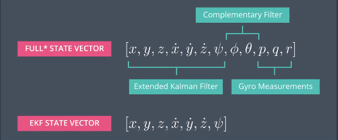

# FCND-Term1-P4-Estimation
Udacity Flying Car Nanodegree - Term 1 - Project 4 - Estimation

### 1. Project Overview

This project is based on [the previous project](https://github.com/binliu-base/FCND-T1P3-Control-of-a-3D-Quadrotor), Instead of using the perfect estimation in last control project, We will developing the estimation portion of the controller, which will fuse 
the noisy inertial sensor data (GPS, IMU, and magnetometer) to estimate current drone position, velocity, and attitude. 

#### 1.1 3D Control Architecture


The 3D Control Architecture Diagram shows the output of the state estimation (red line) gets sent to each controller as control input.

#### 1.2 3D Estimation - State Vector Tradeoffs



We're not going to estimate the entire state using an EKF. We're only going to be using an EKF to estimate x,y, z, there derivatives and their angle psi.
To estimate the body rates p, q, and r we just use the direct measurements from the rate gyros. To estimate the roll and pitch angles which are referred to as the attitude, we're going to use another type of filter called a complimentary filter

Please note, Often, the full state vector actually has more than 12 variables in it. That's because in addition to estimating the typical 12 variables, we often also want to keep track of the IMU biases. Remember from the lesson on sensors that bias is typically modeled as a random walk.
Estimating the bias in real-time like this is what's known as "online identification". We'll learn more about this in the second course of term 2 of this Nanodegree program.

#### 1.3 3D Estimation - EKF Control Tradeoffs

 

We're going to be using the X, Y, and Z accelerations as well as the psi dot of rate gryo as the EKF control inputs. 
Because it is always better to fuse both sensors in the measurement stage and that in particular, accelerometer helps more with the 3D position tracking accuracy whereas gyroscope helps more with the 3D orientation trackingaccuracy ([this paper](https://eresearch.ozyegin.edu.tr/bitstream/handle/10679/947/Fusing%20inertial%20sensor%20data%20in%20an%20extended%20kalman%20filter%20for%203D%20camera%20tracking.pdf?sequence=2&isAllowed=y)).

### 2. Implement of 3D Estimation

We will be building up the estimator in the following steps. 

Project outline:

 - [Step 1: Sensor Noise](#step-1-sensor-noise)
 - [Step 2: Attitude Estimation](#step-2-attitude-estimation)
 - [Step 3: Prediction Step](#step-3-prediction-step)
 - [Step 4: Magnetometer Update](#step-4-magnetometer-update)
 - [Step 5: Closed Loop + GPS Update](#step-5-closed-loop--gps-update)
 - [Step 6: Adding Your Controller](#step-6-adding-your-controller)


#### Step 1: Sensor Noise ####

In the first step,  we will collect some simulated noisy sensor data and estimate the standard deviation of the quad's sensor.


Run the simulator, We can see ~68% of the measurement points fall into the +/- 1 sigma bound.

#### Step 2: Attitude Estimation ####


#### Step 3: Prediction Step ####


#### Step 4: Magnetometer Update ####


#### Step 5: Closed Loop + GPS Update ####


#### Step 6: Adding Your Controller ####


### 3. Project Rubric

#### 1. Determine the standard deviation of the measurement noise of both GPS X data and Accelerometer X data.

I caculate the standard deviation of the measurement noise with the following steps.

1. Turn on log tracing for the scenario by adding the following two commands in 06_SensorNoise.txt.
```
Commands += AddGraph1.LogToFile
Commands += AddGraph2.LogToFile
```
Run scenario 06_SensorNoise, then we will got two log files. One is the measurement of GPS x location, and another is acceleometer x velocity.

2. Write a data processing script (./scripts/process_log.py) 
3. Run the data processing script to caculate the standard deviation for each the measurements. The result show MeasuredStdDev_GPSPosXY is around 0.71, and MeasuredStdDev_AccelXY is around 0.49.

#### 2. Implement a better rate gyro attitude integration scheme in the UpdateFromIMU() function.

Steps of integrating body rates into new Euler angles are as follows.
1. First, Creating a quaternion from the current euler angle estimate with the handy FromEuler123_RPY function.
2. Then integrated the body rate ((rollEst, pitchEst and ekfState(6))) into the quaternion.
3. Finally, convert the quaternion back to the new euler angle.

#### 3. Implement all of the elements of the prediction step for the estimator.

Implementation of the prediction step are as follows,

1. First, Run scenario 08_PredictState with the default code, that using a perfect IMU (QuadEstimatorEKF.attitudeTau = 100, only an IMU), Which will predict the state based on the acceleration measurement. We can see the estimated state does not follow the true state. 
2. We implement the state prediction step in the PredictState() functon in QuadEstimatorEKF.cpp. Then run scenario 08_PredictState, we see the estimator state track the actual state, with only reasonably slow drift.
3. Run scenario 09_PredictionCov with a realistic IMU (one with noise). we see the estimated covariance (white bounds) currently do not capture the growing errors.
4. We calculate the partial derivative of the body-to-global rotation matrix ( `RbgPrime`) in the function GetRbgPrime(), `RbgPrime` is then used in the calculation of Jacobian matrix, the key for performing covariace prediction in EKF. Then rerun scenario 09_PredictionCov, we can see the estimated covariance (white bounds) grows with errors. 

#### 4. Implement the magnetometer update.

The Implement of the magnetometer update has the follows steps.
1. Run scenario 10_MagUpdate with default code£¨without the magnetometer update). We see the estimate yaw is drifting away from the real value (and the estimated standard deviation is also increasing). 
2. Next, We implement the magnetometer update with the equations from section `7.3.2 Magnetometer` from the [Estimation for Quadrotors](https://www.overleaf.com/read/vymfngphcccj#/54894644/) paper.
. After implement the update, then call `QuadEstimatorEKF::Update` to do the state update and covariance update. Please note the difference of measurement and estimated yaw must be normalized before the magnetometer update.
3. Rerun scenario 10_MagUpdate with the magnetometer update code. We can see the estimated standard deviation that accurately captures the yaw error and maintain an error of less than 0.1rad in heading for at least 10 seconds of the simulation. 

#### 5. Implement the GPS update.

The Implement of the GPS update has the follows steps.
1. Run scenario 11_GPSUpdate without the GPS update, but using both an ideal estimator and and ideal IMU. watch the position and velocity errors (bottom right). We can see they are drifting away.
2. Change to using my estimator and the realistic IMU. Rerun the scenario without the GPS update, The drone goes wild from time to time as well, This is due to errors of position and velocity grows rapidly.
3. Implement the EKF GPS Update in the function `UpdateFromGPS()` with the equations from section `7.3.1 GPS` from the [Estimation for Quadrotors](https://www.overleaf.com/read/vymfngphcccj#/54894644/) paper.
4. Rerun the scenario with the GPS update, We can see the position error, and sigma decreased.